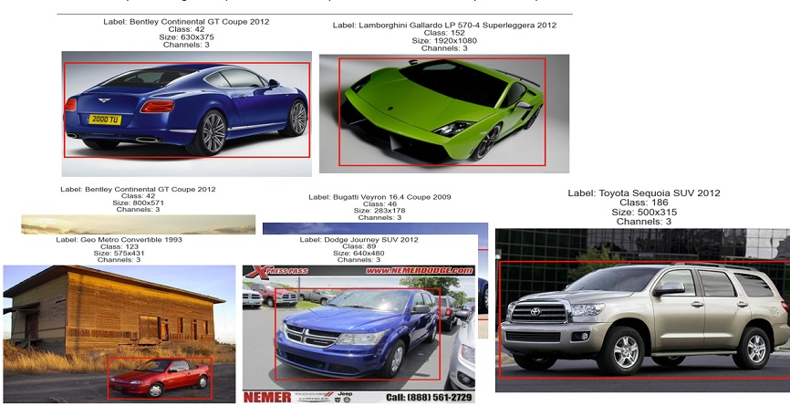
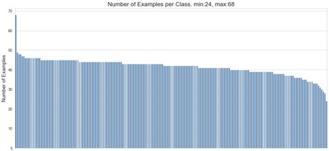
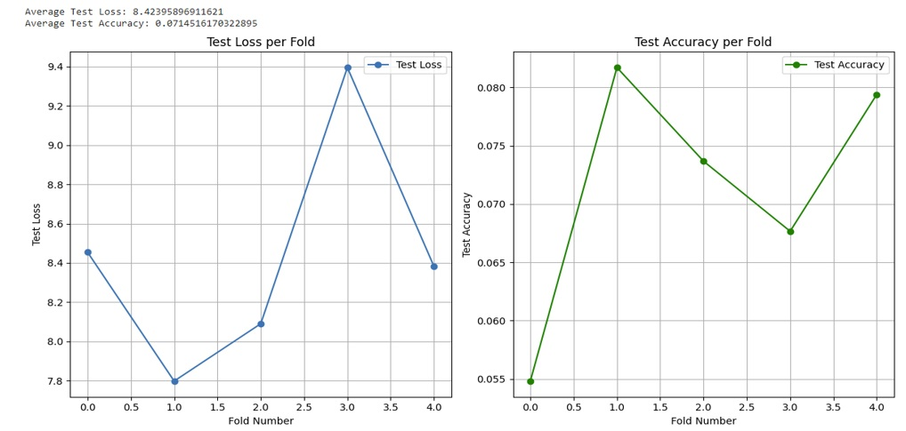
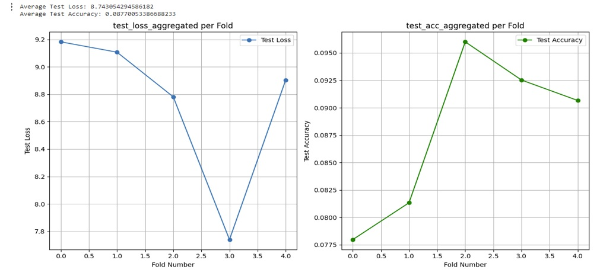
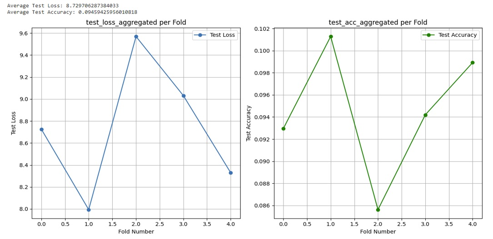
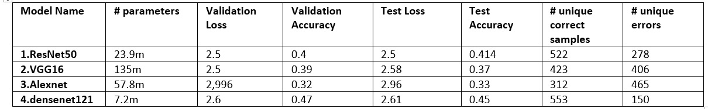
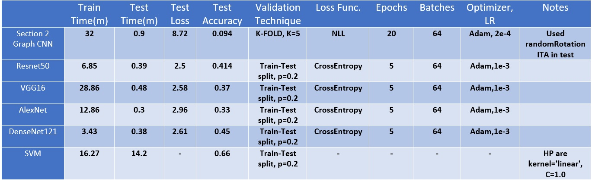

# Image classification - Stanford Cars
 
## Overview
This project was done as a part of the course "Practical Deep Learning Workshop" i am taking. 
While i took classes in machine learning and know the very basic theory, i never really implemented a neural network before, so this was very exciting. 

## Dataset Challenges and Preprocessing
The first step was to look at the dataset and see what's going on there: 
https://www.kaggle.com/datasets/jessicali9530/stanford-cars-dataset 
While looking at the "Discussions" page, and inspecting the dataset myself, it seemed there are some problems.
First of all, the metadata is in .mat, which is not very comfortable to work it. 
Secondly, there are no labels to the test set ! 
There are a few "car-devkit" projects that arguably uploaded a fix to the .mat files, but after inspecting those
Some of the labels in the train set were wrong, and many more were wrong in the test set (to me it seemed like too many).
So after scouraging the internet for a long time, i found this amazing dataset: 
https://www.kaggle.com/datasets/jutrera/stanford-car-dataset-by-classes-folder 
The same dataset, but where the classes are seperated into folders, and they seem to be correct ! 
Great, finally i can start working.

## Exploratory Data Analysis
The dataset consists of 8,144 training and 8,041 test samples across 196 classes.
the metadata provides a path to the image, bounding boxes, class and a label.
The label consists of manufacturer type and year, for example "Ram C-V Cargo Van Minivan 2012"
 Here are some samples: 
 

We can see all of the images are of different sizes, and i also discovered that at least one of them is a single channel(not RGB).
 Lookin at the distrbution, there seems to be a fair class imbalance: 
 

I decided i wanted to make my own dataset, a single csv, a single train and test folders, and already preprocess the images
to 224x224 size and crop them according to bounding boxes.
I have uploaded to kaggle and used this preprocessed dataset for the rest of this assignment.

## Model Training and Evaluation
### Experiment 1
For the inital CNN architecture i have took the one we were shown in one of the course's lectures.
The lecture used MNIST, so i have to make a few adjustments, like RGB conversion, output layer, normalization according to Imagenet.
In addition, i had to also implement K-FOLD.
After some research, i realized there are two ways to implement it, externally and internally.
Externally meaning, just a simple for loop in the range of K, basically creating K-Models.
Or internally, where the implementation is inside the CNN Class.
In both cases the validation set creation occurs in the setup() hook of the class.
I went with external one as it seemed more simple, and chose K=5. 
The train accuracy went up to 0.6 while loss decreased, but the validation showed a very low and slow accuracy(0.055) and a high increasing loss thourgh the last epochs. 
It is clear overfitting is occuring here. 
The test resulst were, not bad, actually higher, than other notebooks i've seen on kaggle that experiemented with graph CNN's 
 

### Experiment 2
To address the overfitting problem, i have decided to add dropout layers, and perform augmentation of random horizontal flip. 
This augmentation is valid since cars are symmetrical. 
In addition to that, i performed Inference-time augmentation of a very slight random rotation. and aggerated 5 versions of it. 
Train and validation accuracy and loss was pretty much the same, a little big higher accuracy though, on test too. 
 
### Experiment 3
I have added a new category of "Honda Civic 2003" with 5 train samples and 5 test samples. 
I also added more metrics(F1,Precision,Recall) and a confusion matrix, which i wish also did in the prior experiments, since confusion matrix can be really helpful in understanding of the results and can answer many "why" questions. 
Not surprisngly, the model was not able to correctly classify this new category, as the sample size was probably too low. 
Test accuracy grew a little bit higher, i wonder if it's because adding this small sample size helped the model generalize better?
 
## Transfer Learning and Feature Extraction
I chose 4 different models to experiemnt with : Resnet50,vgg16,alexnet,densenet121.
All i had to do was change the last output layer, and in just 5 epochs, the results were very interesting. 
DenseNet121 seemed to be the winner at every possible aspect. 
 

So since densenet121 is so great, lets try to use it as feature extractor. 
For this to work i had to remove the top layer and freeze the others, then forward pass.<br.
the result is a tensor of features, which can then be used as an input to a new task. 
I chose to use SVC, and while training it i encountered some complexity problems which caused my workspace to crash, so i had to specify hyperparameters that lower the complexity. 
The test resulsts were pretty cool and reached an accuracy of 0.66, the highest out of the experiments performed so far.
Here's a table that summarizes everything:
 

## Lessons Learned
- The importance of addressing dataset inconsistencies for model training.
- The role of data augmentation and dropout in combating overfitting.
- The potential of transfer learning and feature extraction in improving model performance.
